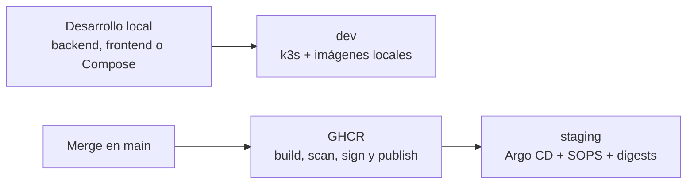

# Atlas Platform

[](https://github.com/albersg/atlas-platform/actions/workflows/ci.yml)
[](https://github.com/albersg/atlas-platform/actions/workflows/security.yml)
[](https://github.com/albersg/atlas-platform/actions/workflows/codeql.yml)
[](https://github.com/albersg/atlas-platform/actions/workflows/release-images.yml)

Atlas Platform es un monorepo "agent-first" para desarrollo y preproduccion que unifica backend, frontend, base de datos, CI/CD, Kubernetes local y guardrails DevSecOps bajo una interfaz operativa comun basada en `mise run`.

## Qué aporta este repositorio

- Unifica tooling, versiones y tareas canónicas con `mise`.
- Hace que humanos y agentes trabajen con el mismo flujo operativo.
- Mantiene calidad y seguridad consistentes en local y en GitHub Actions.
- Conserva una base arquitectónica preparada para crecer a más bounded contexts.
- Se centra en `dev` y `staging`; `prod` queda fuera del alcance operativo actual.

## Stack y automatización

- Aplicación: Python 3.12, FastAPI, SQLAlchemy, Alembic, React, Vite, TypeScript y PostgreSQL.
- Plataforma: Docker Compose para el loop local, k3s + Kustomize para `dev`, Argo CD + SOPS/KSOPS + GHCR para `staging`.
- Calidad: `ruff`, `pyright`, `pytest`, `pytest-cov` y MkDocs Material.
- Seguridad y automatización: `pre-commit`, `gitleaks`, `detect-secrets`, Trivy, CodeQL, Dependabot, GitHub Actions y Cosign para la cadena de release.

## Alcance actual

| Superficie | Objetivo | Modelo operativo |
| --- | --- | --- |
| Local | Loop rápido de desarrollo | Docker Compose o procesos locales |
| `dev` | Laboratorio no productivo en cluster local | k3s + imágenes locales + `kubectl apply` |
| `staging` | Validación preproductiva | Argo CD + SOPS + imágenes de registry por digest |

`prod` no forma parte del alcance actual del repositorio. Cuando exista una necesidad real de producción, se introducirá con infraestructura separada.

## Vista rápida de la plataforma



## Quickstart

Este repositorio asume que las herramientas base ya están instaladas en tu máquina. A partir de ahí:

```bash
mise install
mise run bootstrap
mise run app-bootstrap
mise run check
```

Con esto obtienes:

- toolchain fijado por versión,
- hooks de git (`pre-commit` y `pre-push`),
- dependencias de backend y frontend,
- validación local básica del repositorio.

Primeros loops útiles:

```bash
mise run compose-up
mise run backend-dev
mise run frontend-dev
mise run docs-build
```

Guía completa de arranque: [Quickstart](docs/getting-started/quickstart.md)

## Flujos principales

| Si quieres... | Consulta |
| --- | --- |
| Preparar el entorno por primera vez | [Quickstart](docs/getting-started/quickstart.md) |
| Entender el mapa del repo | [Mapa del repositorio](docs/getting-started/repository-map.md) |
| Trabajar en el loop local diario | [Desarrollo local](docs/development/local-development.md) |
| Desarrollar backend y migraciones | [Desarrollo backend](docs/development/backend-development.md) |
| Trabajar en frontend | [Desarrollo frontend](docs/development/frontend-development.md) |
| Seguir el flujo completo de entrega | [Flujo end-to-end](docs/development/END_TO_END_WORKFLOW.md) |
| Ejecutar calidad, seguridad y CI local | [Calidad y CI](docs/development/quality-and-ci.md) |
| Operar `dev` y `staging` | [Panorama operativo](docs/operations/overview.md) |
| Consultar los runbooks de despliegue | [Runbook k3s](docs/deployment/k3s/RUNBOOK.md) y [Runbook GitOps](docs/deployment/gitops/ARGOCD_SOPS_RUNBOOK.md) |
| Entender promoción de imágenes | [Image promotion](docs/deployment/releases/IMAGE_PROMOTION.md) |

## Arquitectura y layout del repo

Principios principales:

- Arquitectura hexagonal dentro de cada servicio.
- Screaming architecture por capacidad de negocio antes que por framework.
- Monorepo modular con ADR explícito para decidir cuando extraer más servicios.

```text
.
├── apps/
│   └── web/                      # Frontend React/Vite
├── services/
│   ├── inventory-service/        # Backend funcional (FastAPI + Alembic)
│   └── billing-service/          # Scaffold para futuro bounded context
├── platform/
│   ├── argocd/                   # Argo CD core + apps GitOps
│   ├── k8s/                      # Base, componentes reutilizables y overlays
│   └── policy/                   # Policy-as-code para dev/staging
├── scripts/
│   ├── gitops/                   # Bootstrap, render y validacion GitOps
│   ├── k3s/                      # Scripts operativos de k3s
│   └── release/                  # Helpers de promocion por digest
├── docs/                         # Base de conocimiento del proyecto
├── tests/                        # Tests de politica del repositorio
├── mise.toml                     # Fuente de verdad de tools + tasks
└── .pre-commit-config.yaml       # Hooks de calidad y seguridad
```

Documentación de arquitectura:

- [Resumen de arquitectura](docs/architecture/overview.md)
- [ADR monorepo vs multirepo](docs/adr/0001-monorepo-vs-multirepo.md)
- [Hexagonal + screaming architecture](docs/architecture/hexagonal-screaming-architecture.md)
- [Topología de despliegue](docs/architecture/deployment-topology.md)

## Calidad, seguridad y CI/CD

Comandos de referencia del proyecto:

```bash
mise run fmt
mise run lint
mise run typecheck
mise run test
mise run docs-build
mise run check
mise run ci
```

El repositorio mantiene paridad entre local y remoto con:

- `pre-commit` como capa local de formato, lint y seguridad,
- `CI` para `fmt-check`, `check`, `docs-build` y validación de overlays,
- `Security` para escaneo dedicado de repo e imágenes,
- `CodeQL` para SAST en entornos compatibles,
- workflows de release y promocion para imagenes inmutables.

Guía operativa completa: [Calidad y CI](docs/development/quality-and-ci.md)

## Mapa de documentación

- Primeros pasos: [Quickstart](docs/getting-started/quickstart.md), [Mapa del repositorio](docs/getting-started/repository-map.md)
- Desarrollo: [Desarrollo local](docs/development/local-development.md), [Backend](docs/development/backend-development.md), [Frontend](docs/development/frontend-development.md), [Flujo end-to-end](docs/development/END_TO_END_WORKFLOW.md)
- Operaciones: [Panorama operativo](docs/operations/overview.md), [Runbook k3s](docs/deployment/k3s/RUNBOOK.md), [Runbook GitOps](docs/deployment/gitops/ARGOCD_SOPS_RUNBOOK.md), [Promoción de imágenes](docs/deployment/releases/IMAGE_PROMOTION.md)
- Referencia: [Tareas canónicas](docs/reference/commands.md), [Mapa del monorepo](docs/reference/components.md)
- Proyecto: [Gobernanza](docs/project/governance.md), [Modelo operativo](docs/project/operating-model.md)

Portal de documentación: [docs/index.md](docs/index.md)

## Gobierno del proyecto

- [AGENTS.md](AGENTS.md): contrato operativo para agentes.
- [CONTRIBUTING.md](CONTRIBUTING.md): reglas de colaboración y requisitos de PR.
- [SECURITY.md](SECURITY.md): proceso de reporte y requisitos de desarrollo seguro.
- `.github/CODEOWNERS`: ownership obligatorio para revisión.

Resumen de gobierno: [Gobernanza del proyecto](docs/project/governance.md)

## Estado actual

Atlas Platform queda preparado para:

- backend y frontend funcionales,
- migraciones Alembic para el servicio de inventario,
- flujo local coherente con CI y seguridad,
- `dev` sobre k3s con imágenes locales reproducibles,
- `staging` con topología GitOps y promoción por digest.

Modelo operativo, troubleshooting y criterios de escalado: [Modelo operativo del proyecto](docs/project/operating-model.md)
